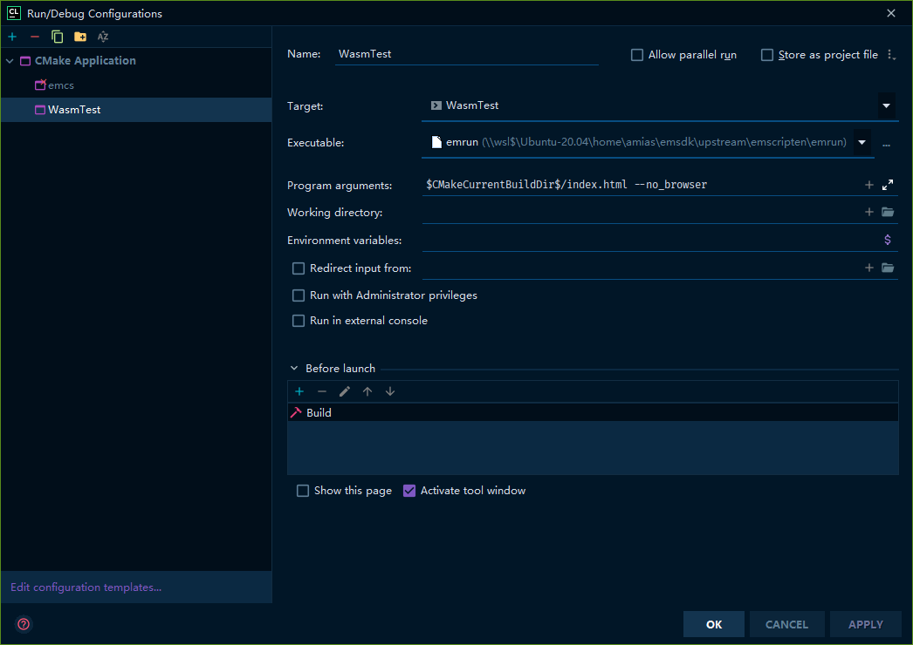
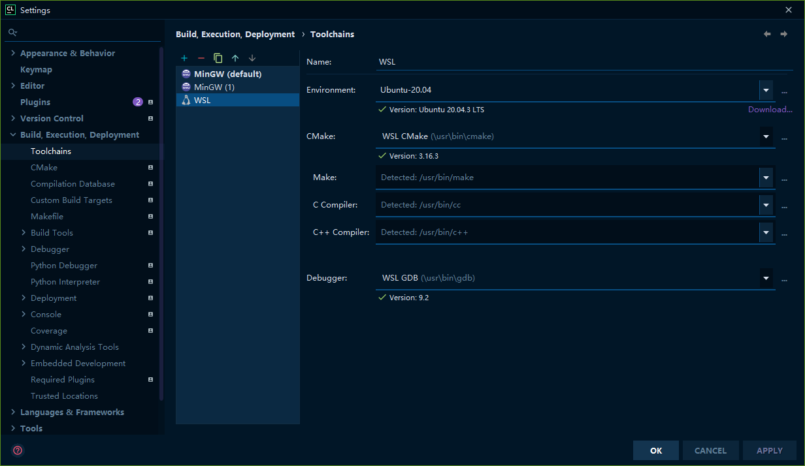

# How to integrate emscripten into CLion


### install Emscripten

```shell
git clone https://github.com/emscripten-core/emsdk.git
cd emsdk
./emsdk install latest # install latest toolchain
./emsdk activate latest
source emsdk_env.sh # make em-prefix command available
emconfigrure cmake . # this is optional
```

you can refer to https://developer.mozilla.org/zh-CN/docs/WebAssembly/C_to_wasm for more 
information

### a sample cmake file:
```cmake
cmake_minimum_required(VERSION 3.14)
project(WasmTest)

set(CMAKE_CXX_STANDARD 17)
set(FLAGS "-o index.html -s WASM=1 -O3")

set(CMAKE_C_FLAGS_RELEASE "${FLAGS}" CACHE STRING "Emscripten-overridden CMAKE_C_FLAGS_RELEASE")
set(CMAKE_C_FLAGS_MINSIZEREL "${FLAGS}" CACHE STRING "Emscripten-overridden CMAKE_C_FLAGS_MINSIZEREL")
set(CMAKE_C_FLAGS_RELWITHDEBINFO "${FLAGS}" CACHE STRING "Emscripten-overridden CMAKE_C_FLAGS_RELWITHDEBINFO")
set(CMAKE_CXX_FLAGS_RELEASE "${FLAGS}" CACHE STRING "Emscripten-overridden CMAKE_CXX_FLAGS_RELEASE")
set(CMAKE_CXX_FLAGS_MINSIZEREL "${FLAGS}" CACHE STRING "Emscripten-overridden CMAKE_CXX_FLAGS_MINSIZEREL")
set(CMAKE_CXX_FLAGS_RELWITHDEBINFO "${FLAGS}" CACHE STRING "Emscripten-overridden CMAKE_CXX_FLAGS_RELWITHDEBINFO")

set(CMAKE_EXE_LINKER_FLAGS_RELEASE "${FLAGS}" CACHE STRING "Emscripten-overridden CMAKE_EXE_LINKER_FLAGS_RELEASE")
set(CMAKE_EXE_LINKER_FLAGS_MINSIZEREL "${FLAGS}" CACHE STRING "Emscripten-overridden CMAKE_EXE_LINKER_FLAGS_MINSIZEREL")
set(CMAKE_EXE_LINKER_FLAGS_RELWITHDEBINFO "${FLAGS}" CACHE STRING "Emscripten-overridden CMAKE_EXE_LINKER_FLAGS_RELWITHDEBINFO")
set(CMAKE_SHARED_LINKER_FLAGS_RELEASE "${FLAGS}" CACHE STRING "Emscripten-overridden CMAKE_SHARED_LINKER_FLAGS_RELEASE")
set(CMAKE_SHARED_LINKER_FLAGS_MINSIZEREL "${FLAGS}" CACHE STRING "Emscripten-overridden CMAKE_SHARED_LINKER_FLAGS_MINSIZEREL")
set(CMAKE_SHARED_LINKER_FLAGS_RELWITHDEBINFO "${FLAGS}" CACHE STRING "Emscripten-overridden CMAKE_SHARED_LINKER_FLAGS_RELWITHDEBINFO")
set(CMAKE_MODULE_LINKER_FLAGS_RELEASE "${FLAGS}" CACHE STRING "Emscripten-overridden CMAKE_MODULE_LINKER_FLAGS_RELEASE")
set(CMAKE_MODULE_LINKER_FLAGS_MINSIZEREL "${FLAGS}" CACHE STRING "Emscripten-overridden CMAKE_MODULE_LINKER_FLAGS_MINSIZEREL")
set(CMAKE_MODULE_LINKER_FLAGS_RELWITHDEBINFO "${FLAGS}" CACHE STRING "Emscripten-overridden CMAKE_MODULE_LINKER_FLAGS_RELWITHDEBINFO")

add_executable(WasmTest main.cpp)
```

### 

```cmake
set_target_properties(executable PROPERTIES SUFFIX ".html")
set_target_properties(executable PROPERTIES LINK_FLAGS "\
    -o index.html\
    -sALLOW_MEMORY_GROWTH=1 -sUSE_GLFW=3 -sUSE_WEBGL2 -sFULL_ES3\
    --shell-file ../sources/core/external/emscripten_html_template.html\
    --preload-file ../assets/fonts/consola.ttf@consola.ttf")
```

`--shell-file` option allow you to use a template HTML files.

`--preload-file` will generate a `.data` file to contain all the file you specified the mapping.

### CMake options: 
set a path variable ```${EMSCRIPTEN_ROOT}``` in CLion. 

```shell
-G "Unix Makefiles"
-DCMAKE_TOOLCHAIN_FILE=${EMSCRIPTEN_ROOT}/cmake/Modules/Platform/Emscripten.cmake
--debug-output
```

### to add options on emcc/em++, just use:
```cmake
set(CMAKE_EXECUTABLE_SUFFIX ".html") # this will make the emcc/em++ output html(auto generated)
```

for another options, target_link_libraries is a good choice
```cmake
target_link_libraries(WasmTest "-s WASM=0")  # abandon wasm file output
```

### run configuration:



### use WSL toolchain:


## now you should use emscripten toolchain to compile your project, have fun!